## Linear Regression - Formulation
  
### Introduction
Scenario: A company “I” is planning for its next growth phase through digital marketing and is looking for valuable insights from past data. Before deciding the marketing budget, the business team wishes to understand the relationship between the marketing budget and the actual sales in the past by answering these questions -

Is there any association strength between marketing budget and sales? (If the association is weak, one could argue that the money is better spent on things other than marketing!)
Given a specific marketing budget, can we predict sales with a high level of accuracy?
Linear Regression is a fundamental modeling technique that should be used as a starting point when creating data-driven prediction models like the one discussed above.
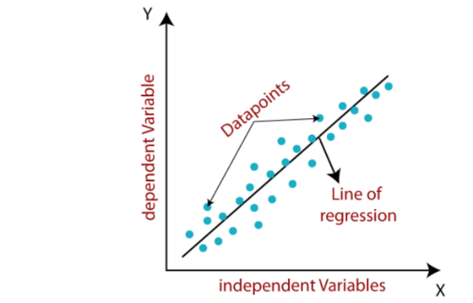

Of course, with enough skill and experimentation, more advanced machine learning techniques might yield better performance, but to start with, let’s build our linear regression models, and then decide if it is worth putting in more resources to achieve better results.

Linear regression aims to find the line that best approximates or fits a set of n points in a plane. In our scenario, we can visualize each observed point p (x, y) to be the result of a linear function y = f(X), and given a set of n such points (p1, p2, ..., pn), we look for the f(X) that best describes them. 

Using this technique, we can identify hidden insights and trends in data and hence describe a large set of noisy data points using a linear equation.

X is the predictor or independent variable, and y is our response or dependent variable. The model assumes that the association between the dependent and independent variables is linear. So by using this function f(X), we try to understand the linear relationship between one or more independent variables and a dependent variable. In the scenario described above, the marketing budget is the independent input X, and the sales (of units) is the dependent output y.

Let’s first try to understand our one-dimensional example in detail, following which we will generalize the result to n-dimensions. For one dimension, the equation for our problem reduces to

y = aX+b

Here, X is the predictor/independent variable, and y is the response/dependent variable. The slope of the line (coefficient) is a, and the intercept (bias) is b (the value of y when X = 0). Intuitively, we can interpret a as the influence or weightage X has in determining y and b as the effect of unknown/other factors on y.

Replacing these with our scenario’s predictor and response variables, we get

sales ≈ a × marketing + b

We can use our training data to estimate a and b for the model coefficients, which, in turn, can predict future sales based on a given marketing amount.

salesestimate ≈ amodel × marketing + bmodel

where salesestimate is the estimated value of sales based on the equation we just modeled.

### Formulation
Fitting a linear regression model on the data only makes sense if the inputs actually affect the output in some way. Otherwise, we would either get a model that has low or sometimes even incorrect predictive power, or we would not get a model at all. Thus, before trying to fit a linear model to the observations, we must first determine whether or not the variables are related. This isn't to say that one variable causes the other (for example, the presence of police officers at a crime scene does not imply that they are the perpetrators of the crime), but that there is a statistically significant relationship between the two variables.

While determining the strength of a relationship between two variables, a scatterplot can be helpful. If the explanatory and dependent variables appear to have no relationship (i.e., the scatterplot shows no increasing or decreasing trends), fitting a linear regression to the data is unlikely to yield a useful model.

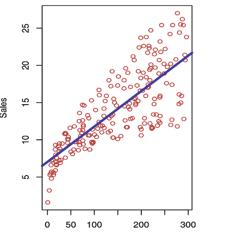

Qualitatively, we can observe from the scatterplot given above that there is a positive, linear association between sales and marketing, i.e., if we increase the marketing budget, we should observe an increase in sales and vice versa. Let’s now discuss a method to quantify the strength of this relationship.

Correlation Analysis
Pearson’s correlation coefficient, r(Y, X), is a statistic that indicates how dependent Y is on X. The correlation coefficient ranges from -1 to 1, where 1 indicates that Y always increases when X increases and vice versa. A value of 0 indicates that there is no relationship between X and Y; in effect, they are independent of each other. A value of -1 indicates a perfect opposite relation, i.e., Y always decreases when X increases and vice versa. Intermediate negative or positive values indicate an imperfect negative or positive relationship between X and Y, respectively.

Calculating Correlation

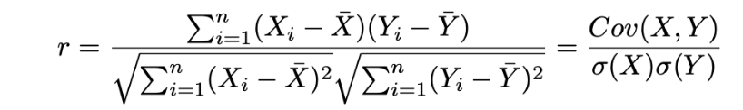
We calculate the correlation coefficient using the above formula, summarised as the covariance between X and Y divided by the standard deviation of X and Y. An easy way to understand how correlation works is to look at the numerator of the correlation formula. 

Notice that when both Xis and Yis are larger than their respective means, the numerator would have a positive sign. The same happens when they are smaller than their means. In these cases, the overall correlation value will come out to be positive. This fits with our intuition that when X increases, Y increases as well, leading to a positive correlation. 

The opposite happens when the Xis are greater than their mean but the Yis are lesser, or vice versa. In these cases, the numerator will be negative and hence the overall correlation value will be negative as well.

When there is no correlation, some of the numerator terms will be positive and some will be negative and they ultimately cancel out, leading to correlation values close to 0.

These observed correlations drive many of the predictive models we build. In our problem statement, the correlation between marketing and sales is 0.782, indicating a strong positive relationship between the two. Other examples where correlation can provide meaningful insights are:

Does the number of absences from school affect the grades of a student? The observed correlation between skipping school/classes and performance in exams (grades) is r = −0.61, indicating a strong negative correlation. This means that the more you miss school, the lesser your grades are.
Does smoking affect health? The observed correlation between a group’s affinity to smoke and their mortality rate is r = 0.716, so yes, it’s seriously affecting your health.
Significance of Correlation
Strength of correlation (R2): In a basic linear regression, the square of the sample correlation coefficient, R2, predicts the fraction of the variation in y explained by X. Height and weight have a correlation of roughly 0.8 and a corresponding R2 value of 0.64, which means height explains about two-thirds of the variance in the weight of a person. We can create a correlation matrix for each predictor with our target variable to understand their relationship with y and test for correlation.

## Estimation
In our regression equation y = aX + b, a and b are unknown. To use the equation to make predictions, we must first estimate these coefficients using data. Let's assume that (x1, y1), (x2, y2), ..., (xn, yn) are n data points. We want to find an intercept b and a slope a such that the resulting line best fits these points, i.e., the line is as close as possible to the given n observations.

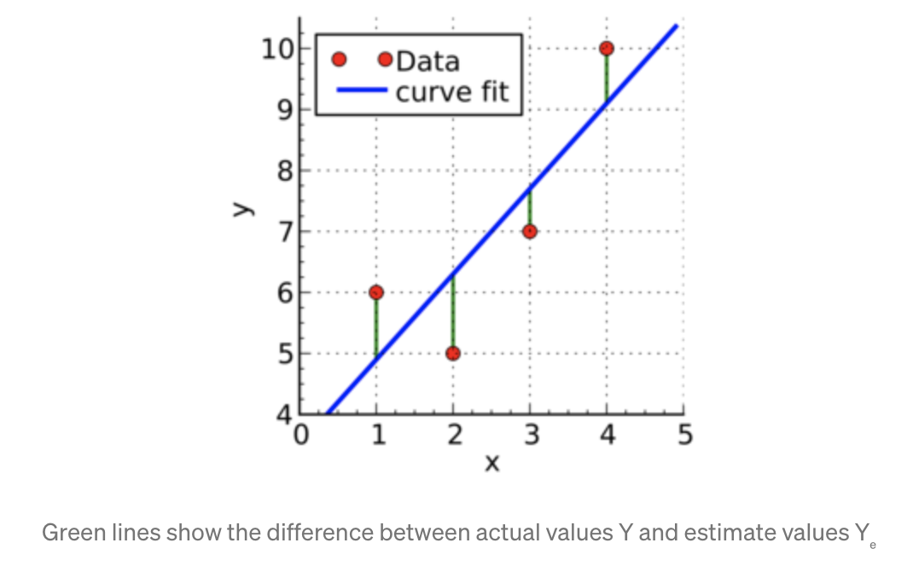

In other words, we need to find statistically significant values of the coefficients a and b that minimizes the difference between sales and salesestimate

For each point (xi, yi), we define the residual error, i.e., the difference between the estimated and actual values, as

ri = yi − f(xi)

where f(xi) = yestimate = aXi +b and f(xi) is the linear function’s estimated value of yi.

Hence, the residual error in our case would be: 

ri =  sales(estimate) - sales

Note that there are n residuals and hence, we need to first come up with a reasonable combination of these terms which could be minimized.

### Ordinary Least Squares Regression 
In Ordinary Least Squares (OLS) regression, we define the sum of the squares of the residuals of all points as the loss function and try to minimize it. This metric was chosen because 

Squaring the residual disregards the signs of the errors; thus, positive and negative residuals do not neutralize each other.
It results in a reasonably good system for determining the coefficients of the best fit line
The Residual Sum of Squares (RSS) is defined as

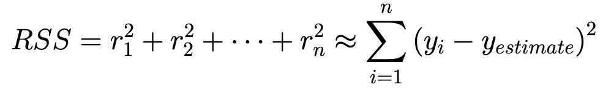

where n is the total number of data points.

With little calculus, we can show that the value of these coefficients can be determined using

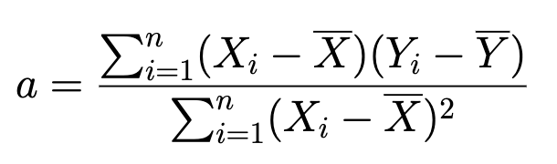

and

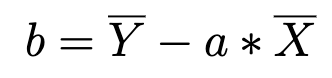

where X̄ is the mean of X values and Ȳ is the mean of Y values. It becomes clear from the above equation that the resulting fitted line would pass through the point (X̄, Ȳ), i.e., the mean of the given data points. This result clearly illustrates how linear regression tries to find or fit a line that can explain the maximum amount of data. The equation for the slope or a clearly shows how the values will change depending on the relation between X and Y. If for a small value of Xi - X, the value of Yi - Y is larger, a will be larger. This is intuitively appropriate as a small increase in X leads to a larger increase in Y, hence the line will be steeper. The reverse is true when a small increase in X leads to a small increase in Y and the slope will be smaller. If you are familiar with statistics, you may recognize a as simply Cov(X, Y) / Var(X) which reinforces how X and Y influence each other. If the covariance is large, the slope will be larger and vice versa.

**Insights**

In our 2-d example, if a > 0, then x (predictor) and y (target) have a positive relationship. As a result, an increase in x will increase y.
If a < 0, then x (predictor) and y (target) have a negative relationship. As a result, an increase in x will result in a decrease in y.
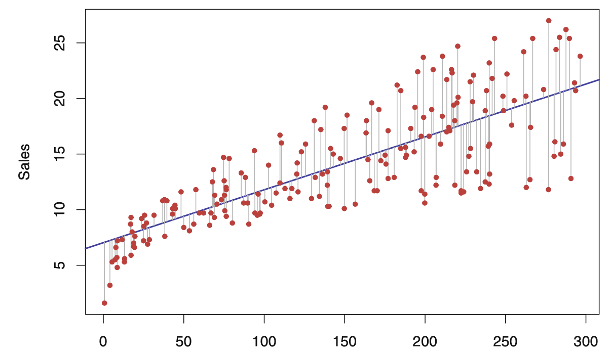

The OLS method fit for the regression of sales onto the marketing budget is shown for the marketing-sales data. Minimizing the sum of squared errors helps to obtain the best fit. Each grey line segment denotes a mistake, and the model averages their squares as a compromise.

Using this technique, we calculate the coefficients to be a = 0.0475 and b = 7.03, and so our equation becomes : 

sales ≈ 0.047 × marketing + 7.032

This can be interpreted as, on average, \$100 spent on marketing should translate to a sale of ≈ 11.73 units.

### Multivariate Linear Regression
Suppose we need to expand our prediction strategy to combine advertisement costs of different types, i.e., we want to understand the relationship between sales and marketing through TV, Social Media, and Newspapers. Note that since we have more than one independent variable now, our linear equation changes to

sales ≈ a1 × marketingTV + a2 × marketingSocial Media + a3 x marketingNews + b

Estimating coefficients a1, a2, a3 and b gives us the equation (we will derive the formula in a later section)

sales ≈ 0.046 × marketingTV + 0.188 × marketingSocial Media + (-0.001) x marketingNews + 2.921

It is easier to map sales estimates in terms of multiple marketing channels after this, i.e., if we plan to spend $500 on TV marketing and $400 on Social Media marketing, we could expect to sell around 101 units. News marketing is ignored here as its coefficient is negligible. It must not be contributing to sales and, in any case, might cause the sales to fall (its weight is negative).

Note that in the first scenario where we were trying to find the relationship between sales and overall marketing, we could represent the data in a 2-dimensional plane since there was only a single independent variable. Here, we extended the algorithm to include 3 variables. However, in general, there might be n independent variables X1, ..., Xn, and one dependent variable y, requiring an (n+1)-dimensional space for representing the data. Hence, a general linear regression line has an equation of the form.

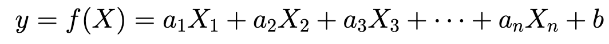

Here, X1, ..., Xn are predictors, and a1, ..., an are coefficients of this linear function. Geometrically, this equation represents an n-dimensional hyperplane. A more mathematically convenient way to write the above equation is

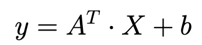

where A = [a1, a2, ..., an]T is the column-vector of coefficients and X = [X1, X2, ..., Xn]T is the column-vector of independent predictors. This equation leverages the power of matrix operations to easily perform the linear regression steps.

Each of the independent variables, X1, ..., Xn, explains some part of the relationship with y through its corresponding weight a1, ..., an. However, there might be other unknown or uncaptured factors that affect y, directly or indirectly. In order to account for such terms, an extra bias term, called b, is included in the equation. The bias affects the regression model independently of all the other known predictors.

### Assumptions on Data
**Linearity** - The relationship between the inputs and output must be linear to obtain a good model using linear regression. A good way to check if a linear relationship exists is to visualize the relation using a scatterplot of the dependent variable vs each of the independent variables. A general increasing or decreasing trend in a straight line is a good indication of linearity. In case, the relationship does not follow a straight line, you might need to preprocess the data appropriately. For example, a log-transform will convert an exponential relationship to a linear one.
**Low Noise** - Ideally, there should be a strong relationship between the input and output variables, wherein a change in one input variable leads to a corresponding effect on the output. However, sampled data are inherently noisy, which weakens this relationship and makes the input variables less predictive. You may need to perform data cleaning, wherever required to improve the predictive power of the model.
**Non-Collinearity** - When your input variables are highly connected, linear regression will overfit* your data. Calculate pairwise correlations for your input data and exclude the ones that are the most correlated.
Gaussian Distributions - Linear regression will make more reliable predictions if your input and output variables have a Gaussian distribution. You can use transforms like log or BoxCox to make their distribution Gaussian type.

### Hypothesis Testing

To find if the regression line is statistically significant or not, we conduct hypothesis tests* on the estimated coefficients. Hypothesis Testing is a way to essentially determine whether our results are valid by calculating the probability/odds that they happened by accident. If our results were obtained by accident, the experiment would not be repeatable and thus will be of little value.

Null Hypothesis (H0): There is no relationship between X and Y 

Alternative hypothesis (Ha): There is some relationship between X and Y.

Here, the null hypothesis says that our coefficient a is not significant, i.e., a = 0, whereas the alternate hypothesis states that a ≠ 0. In our case, this means: 

If the null hypothesis is not rejected, a is zero, implying that a is insignificant and useless in the model.
If the null hypothesis is rejected, a is not zero, and the fitted line is significant.
So how do we test if the null hypothesis is true or not?

We can test this hypothesis using t-statistics. Here, we measure the deviation of our coefficient a from 0 to determine if the coefficient is not zero because our estimate for it is substantially far from zero. We can formulate it as

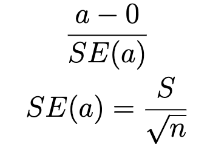
where SE(a) is the standard error of the dataset, n is the population or data size and S is the standard deviation of the dataset. a is our estimated coefficient, and we subtract 0 because our null hypothesis assumes a to be zero. Using this t-score, we can derive a p-value that will determine the level of confidence we have in our alternative hypothesis. In effect, the p-value is the probability that the results we have obtained are random and insignificant, i.e. it is the probability that the null hypothesis is true.

We can now draw conclusions based on the p-value in relation to the given significance level, i.e., if the p-value is less than 0.05, the null hypothesis is rejected, and we can conclude that a is indeed significant. A p-value above 0.05 would indicate that a is not significant and the current model is unable to explain the data.

### Issues with MultiColinearity
Let’s take the previous example of Sales vs. TV, Social media, and News marketing and construct a correlation matrix to observe it. We can observe that the correlation between Social media and newspapers is 0.35, which is decent enough. This indicates that these two predictors are linearly related to each other.
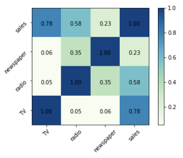

How to fix it? 

**Selection** - We can drop all those predictors that are correlated to each other and proceed with those that have a high correlation with the dependent variable. We might consider dropping either Social media or News in this case.

**Modification **- We can derive new types of insights from the pair of predictors to eliminate the correlation without losing valuable insights. For example, suppose a train arrival prediction system has the distance between two stations (1), overall remaining distance to the destination (2), and time taken (3) as predictors. In that case, deriving the train’s average speed could be an excellent way to address the collinearity between predictors 1 and 2.  

A general rule of thumb can be that if we're unsure which predictors to include in the model, creating a correlation matrix/heat map and choosing those independent variables with a high correlation with the dependent variable might be a good starting point.

From the correlation map given above, we can observe that none of the variables TV, News, and Social media have a very high correlation amongst each other, except Social media and News. Also, News has a low correlation with Sales (only 0.23), and should not affect the Sales too much. In fact, in the model that we obtained in the earlier section, we saw that the weight obtained for News was very low. Thus, it would be a good idea to drop News as a predictor and proceed with TV and Social media to create the model.

### Impact of Outliers 
After we fit the line, points that are far away from the line, and thus have a large residual value ri = yi − f(xi), are known as outliers.

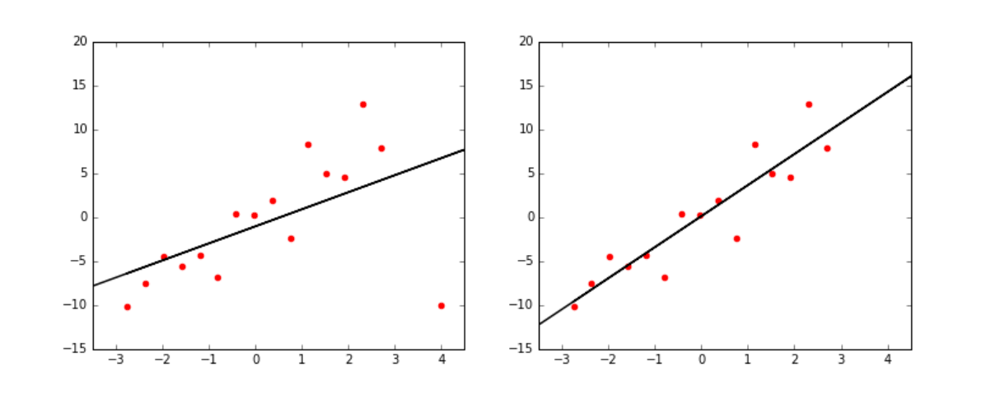

OLS regression seeks to find the parameter estimates that minimize the sum of the squared errors over all training points. So the observations that are far from the trend of the majority of the data will have large residuals. Because of this quadratic weight of the residuals, outlying points can significantly affect the model fit. A point at a distance of 10 from its estimated value has 100 times the impact on training error than a point only 1 unit from the fitted line. 

This creates a problem when the outlier points represent noise instead of the actual signal. The regression line would go out of its way to accommodate the bad data instead of fitting the good.

Therefore identifying outliers and dropping them can result in a more robust fit. The most straightforward approach is to fit the entire set of points and then use the magnitude of the squared residual ri = (yi − f(xi))2 to decide whether point pi is an outlier or not.

**Lurking Variables**

We may consider other variables if nonlinear signals exist in the relationship between an explanatory and dependent variable. A lurking variable exists when the relationship between two variables is significantly affected by a third variable not included in the modeling effort. For example, a recent study indicated a high correlation between diet soda consumption and accidents. Even though it would seem that soda consumption might be related to accidents, it could simply be due to an increase in the population.

**Variable Selection ** 

In the case of multiple linear regression, only some of the predictors might be useful in modeling the response variable, and we’d need to select these variables beforehand. In the earlier section, we talked about multicollinearity and how we can select or drop variables based on it. In this section, we talk about individual variables and selecting them based on their individual effect on the model. The best way to do that would be to try out various models with different sets of predictors. 

For example, in our sales prediction scenario, we can have one model containing TV marketing only, another one containing Social media marketing, and a third model with News marketing. We could then select TV and Social media marketing together while modeling, Social media and News marketing, and so on. Various statistics such as Adjusted R2, AIC (Akaike’s Information Criteria), etc. can be used to select the best model out of all the possible subsets of predictors. 

Note that in case the number of predictors is very big, trying out all possible combinations isn’t feasible and so we shift to an automated approach to perform the selection. 

**Forward Selection **

We begin with a null model, which has only an intercept and no predictors. We then construct n linear regressions and add the predictor with the lowest RSS to the null model. Now that we have a two-predictor model, we repeat the procedure to identify the RSS predictor with the lowest value again to add. We keep repeating this process until we fulfill the predefined stopping criteria.

**Backward Selection**

This is a top-down approach, i.e., we begin by removing the predictor with the highest p-value (least statistically significant) from the model. We repeat this process until we have the desired number of predictors satisfying our significance criteria.

### Gradient Descent for Regression
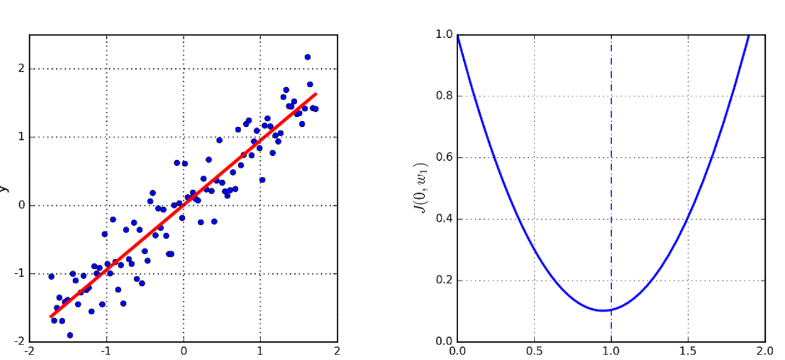

Linear regression defines a convex parameter space, where each point represents a possible line, and the minimum point defines the best fit line. Gradient Descent can help us find that best fit line for a given set of data points in a much smaller number of iterations. It is particularly useful when we have many features and the coefficient calculation becomes computationally expensive due to feature size. 

For this method, we will use the mean squared error (residuals) as our loss function to calculate error to minimize it to find the best fit line. 

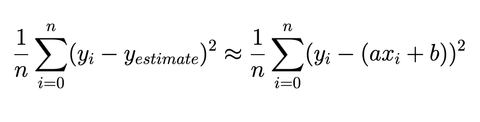
The best possible regression line y = ax + b can be found by identifying the a, b that minimizes the error of the fit, defined by the minima of a convex function. 

Since our loss function is convex*, we can find the minima of a convex function simply by starting at any random point and repeatedly walking in a downward direction until there is no way down and we reach the global minima. This is the point that defines the coefficients of the best fitting regression line as our residual error would be minimal due to gradient descent on the loss function. 

The general idea is
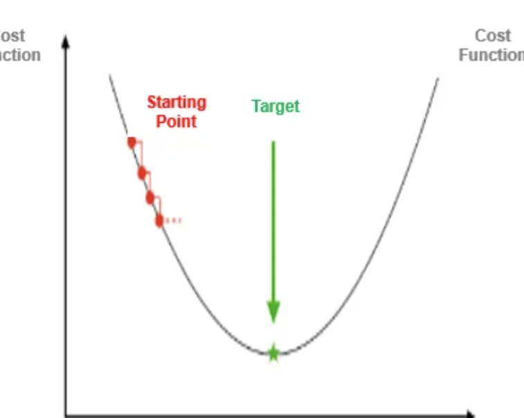
Start at an arbitrary point
Check for the steepest direction which goes downwards (Using calculus)
The size of the step is defined by the learning rate (α)
Take a step in that direction 
Repeat until we reach the minima.

The size of our step is known as the learning rate, and it tells us the rate at which we find the minima. If we take small steps towards minima, repeatedly referring to the partial derivatives, we will reach there, but only very slowly. However, a bigger learning rate might make us jump past the minima. We update values of coefficients a and b until our loss function is a very small value (ideally 0), leading us to the optimum value of coefficients for a best-fit line.

### Regularisation 
There are several limitations of the OLS method to estimate coefficients, namely : 

OLS isn’t valid when the number of predictors exceeds the number of observations; 
In the case of a large number of predictors, it doesn’t differentiate “important” from “less important” predictors in a model, so it includes all of them and tries to find coefficients that result in the lowest Residual Sum of Squares (RSS). This strategy leads to overfitting a model and failure in finding unique solutions. 
Since OLS considers each predictor equally, it may not be the best model and will give a coefficient for each predictor provided. Thus, it ends up including terms with little predictive power.
OLS often outputs a low-bias/high-variance model* that exhibits overfitting, in which the model explains random noise in the data on top of the overall trend. 
The least-squares method also has issues when dealing with multicollinearity in data. 
To deal with the high variance, low bias model, which is often the case with OLS due to its tendency for treating all predictors identically, we may be able to enhance our model by trading part of that variation for bias to decrease our overall error.

This trade-in comes in the form of regularization to balance the tradeoff. It penalizes the coefficients and selects the best predictors from a large set by adding a small bias to manage the tradeoff due to high variance. Simply put, regularization is a way of making our model try to find the best fit for the training set under the constraint that it should learn the simplest possible model.

**Ridge Regression**

We extend the OLS loss function and impose a penalty equivalent to the sum of squares of the model's coefficients.

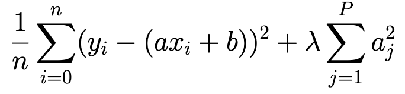
The left side is our usual RSS term, and we add the sum of squares of each coefficient. After that, the model is standardized by multiplying it by the penalty/regularization term. That's what we call a correction.

Here, λ has a vital task to play. It permits the proportional effects of the two terms to be regulated.

If λ is zero, this results in the classical regression equation. Consequently, the higher the λ values, the greater the penalty, greater the bias added. Therefore, the size of the coefficients is reduced as it needs to balance both terms to keep the loss minimum.

So, this method minimizes not only the squared error but also the size of the coefficients!

It shrinks the parameters. Therefore, it is used to prevent multicollinearity
It reduces the model complexity by coefficient shrinkage
Lasso Regression
Ridge regression optimizes to select small coefficients for the model, and because of the RSS loss function, it particularly punishes the largest coefficients. If we want to perform feature selection and reduce the number of predictors, Lasso regression is the way to go.

Lasso zeroes out most of the coefficients, resulting in a simpler and more robust model, which fits the data almost as well as the unconstrained linear regression.

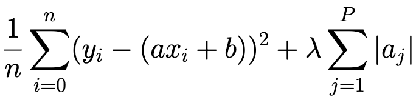

λ ≥ 0 is a tuning parameter for setting the strength of the penalty. As λ increases, more coefficients become zero, and fewer predictors are selected, which can help perform feature selection. 

Small coefficients, low correlation with the objective function, high correlation with another feature in the model, and no evident justifiable association with the target should be the first features to be deleted. 

For example, a well-known study found a substantial link between the US gross national product and Bangladesh's yearly butter output volume.